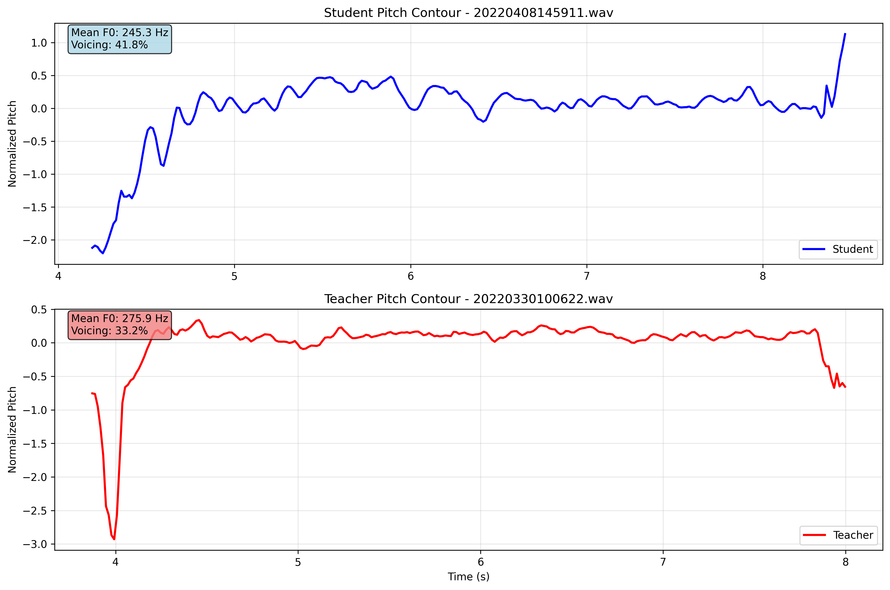
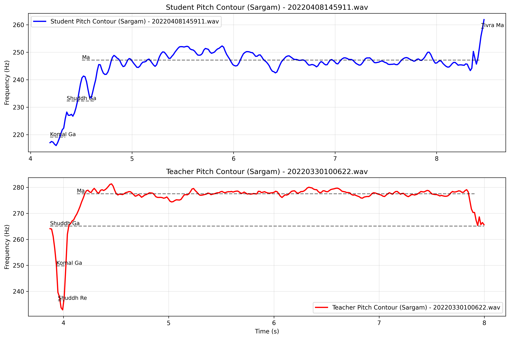
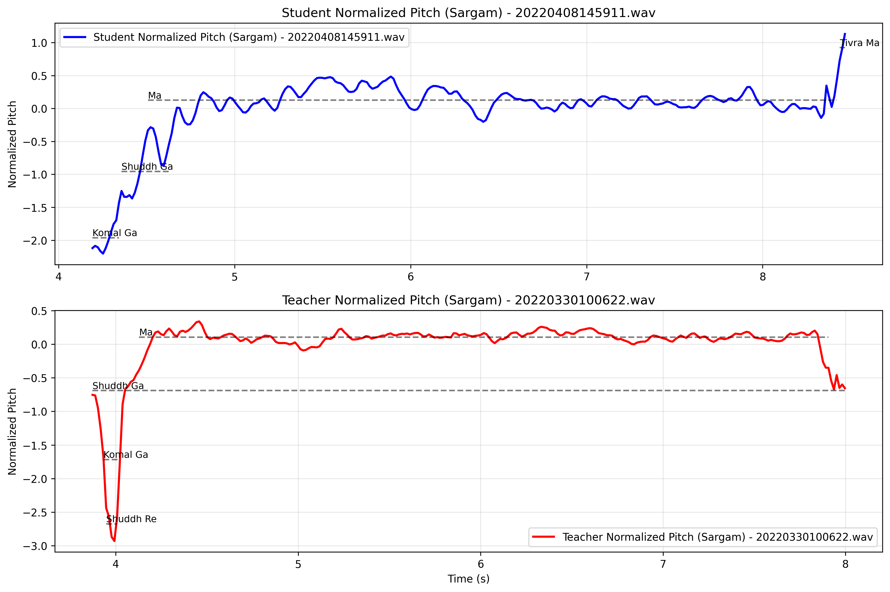
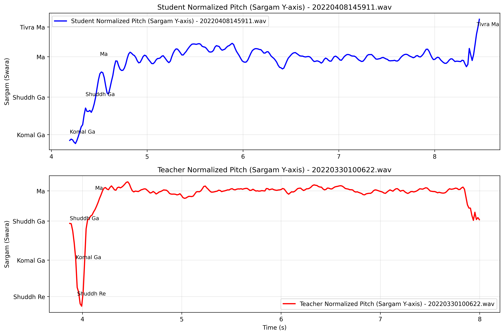

# 2025_musiclearn_async

## Table of Contents

1. [Prerequisites](#prerequisites)
2. [Installation](#installation)  
3. [Understanding the Data Structure](#understanding-the-data-structure)
4. [Method 1: Using Parselmouth (Recommended)](#method-1-using-parselmouth-recommended)
5. [Normalisation Techniques](#normalisation-techniques)
6. [DTW Analysis](#dtw-analysis)
7. [Results](#results)
8. [Advanced Features - Not yet implemented](#advanced-features)
9. [Troubleshooting](#troubleshooting)

## Prerequisites

- Python 3.6 or higher
- Audio files in WAV format
- Metadata CSV file with file information
- Basic understanding of audio processing concepts

## Installation

```bash
pip install praat-parselmouth pandas matplotlib numpy
```

## Understanding the Data Structure

Your directory structure should look like this:

```
project/
├── metadata.csv
├── pitch_contour_extractor.py
├── pitch_normalised_contour_extractor.py
├── audio_subset/
│   ├── student/
│   │   ├── 20220408145911.wav
│   │   ├── 20220407121244.wav
│   │   └── ...
│   └── teacher/
│       ├── 20220330100622.wav
│       ├── 20220329084512.wav
│       └── ...
└── output/
    ├── pitch_plots/
    ├── pitch_plots_normalised/
    ├── pitch_normalised_analysis_summary.csv
    └── pitch_data_extracted.csv
```

### Metadata CSV Format

Your `metadata.csv` should have the following columns:

| s_file | t_file | s_bpm | t_bpm | s_scale | t_scale | ground_truth |
|--------|--------|-------|-------|---------|---------|--------------|
| 20220408145911.wav | 20220330100622.wav | 110 | 110 | G3 | A3 | "[['0', '10.33', 'P'], ['3.919', '4.203', 'T']]" |

## Method 1: Using Parselmouth (Recommended)

### Basic Pitch Extraction Function

```python
import parselmouth
import numpy as np

def extract_pitch_contour(audio_file_path, pitch_floor=75, pitch_ceiling=600, time_step=0.01):
    """
    Extract pitch contour from an audio file using Parselmouth/Praat
    """
    try:
        # Load the sound file
        sound = parselmouth.Sound(audio_file_path)
        
        # Extract pitch using Praat's algorithm
        pitch = sound.to_pitch(time_step=time_step, 
                              pitch_floor=pitch_floor, 
                              pitch_ceiling=pitch_ceiling)
        
        # Get the pitch values and times
        pitch_values = pitch.selected_array['frequency']
        times = pitch.xs()
        
        return times, pitch_values
        
    except Exception as e:
        print(f"Error processing {audio_file_path}: {str(e)}")
        return None, None
```

### Complete Processing Pipeline

```python
import pandas as pd
import matplotlib.pyplot as plt
import os

def process_metadata_and_plot(csv_file_path):
    """
    Complete pipeline to process metadata CSV and create pitch plots
    """
    # Read metadata
    df = pd.read_csv(csv_file_path)
    
    # Create output directory
    os.makedirs("pitch_plots", exist_ok=True)
    
    results = []
    
    for idx, row in df.iterrows():
        print(f"Processing pair {idx + 1}/{len(df)}")
        
        # Construct file paths
        student_file = f"audio_subset/student/{row['s_file']}"
        teacher_file = f"audio_subset/teacher/{row['t_file']}"
        
        # Extract pitch contours
        student_times, student_pitch = extract_pitch_contour(student_file)
        teacher_times, teacher_pitch = extract_pitch_contour(teacher_file)
        
        if student_times is not None and teacher_times is not None:
            # Create comparison plot
            create_comparison_plot(
                student_times, student_pitch, row['s_file'], row['s_bpm'], row['s_scale'],
                teacher_times, teacher_pitch, row['t_file'], row['t_bpm'], row['t_scale'],
                idx
            )
            
            # Store results for further analysis
            results.append({
                'index': idx,
                'student_file': row['s_file'],
                'teacher_file': row['t_file'],
                'student_times': student_times,
                'student_pitch': student_pitch,
                'teacher_times': teacher_times,
                'teacher_pitch': teacher_pitch
            })
    
    return results

def create_comparison_plot(s_times, s_pitch, s_file, s_bpm, s_scale,
                          t_times, t_pitch, t_file, t_bpm, t_scale, index):
    """
    Create a comparison plot for student and teacher pitch contours
    """
    fig, (ax1, ax2) = plt.subplots(2, 1, figsize=(12, 8))
    
    # Clean pitch data (replace 0s with NaN for better plotting)
    s_pitch_clean = s_pitch.copy()
    s_pitch_clean[s_pitch_clean == 0] = np.nan
    
    t_pitch_clean = t_pitch.copy()
    t_pitch_clean[t_pitch_clean == 0] = np.nan
    
    # Plot student pitch contour
    ax1.plot(s_times, s_pitch_clean, 'b-', linewidth=1.5, label='Student')
    ax1.set_title(f"Student: {s_file} (BPM: {s_bpm}, Scale: {s_scale})")
    ax1.set_ylabel('Pitch (Hz)')
    ax1.grid(True, alpha=0.3)
    ax1.legend()
    
    # Plot teacher pitch contour
    ax2.plot(t_times, t_pitch_clean, 'r-', linewidth=1.5, label='Teacher')
    ax2.set_title(f"Teacher: {t_file} (BPM: {t_bpm}, Scale: {t_scale})")
    ax2.set_ylabel('Pitch (Hz)')
    ax2.set_xlabel('Time (s)')
    ax2.grid(True, alpha=0.3)
    ax2.legend()
    
    plt.tight_layout()
    
    # Save plot
    plot_filename = f"pitch_plots/comparison_{index:03d}.png"
    plt.savefig(plot_filename, dpi=300, bbox_inches='tight')
    plt.close()
    
    print(f"Saved: {plot_filename}")
```

## Normalisation Techniques

### Why Normalization is Needed - Raw Pitch Output Characteristics:
- **Student (female)**: Typically 180-300 Hz range
- **Teacher (male)**: Typically 80-180 Hz range  
- **Anatomical differences**: Vocal fold size creates systematic frequency differences
- **Comparison challenge**: Raw values cannot be directly compared across speakers

### 1. Z-Score Normalization (Standardization)
```
z = (frequency - speaker_mean) / speaker_std_dev
```
- **Result**: Mean = 0, Standard deviation = 1
- **Use when**: Statistical analysis, machine learning
- **Advantage**: Both speakers on same scale
- **Caution**: Problems with flat contours (low std dev)

### 2. Semitone Conversion
```
semitones = 12 * log2(frequency / reference_frequency)
```
- **Reference options**: Speaker mean, 100 Hz, musical note
- **Result**: Perceptually meaningful intervals
- **Use when**: Musical analysis, cross-linguistic studies
- **Advantage**: Reflects human pitch perception

### 3. Mean-Centered Hz
```
centered = frequency - speaker_mean
```
- **Result**: Relative pitch movement in Hz
- **Use when**: Preserving Hz units is important
- **Advantage**: Simple, interpretable
- **Best for**: Student-teacher prosody comparison

### 4. Proportion of Range (POR)
```
POR = (frequency - speaker_min) / (speaker_max - speaker_min)
```
- **Result**: Values between 0 and 1
- **Use when**: Comparing pitch range utilization

### For 44.1kHz, 32-bit Audio Files:
1. **Extract raw pitch first** using Praat/Parselmouth
2. **Apply normalization before plotting/analysis**
3. **Choose method based on research goals**:
   - **Prosody comparison**: Mean-centered Hz or semitones
   - **Statistical modeling**: Z-score normalization
   - **Cross-speaker analysis**: Semitones relative to speaker mean

### Best Practice Workflow:
```python
# 1. Extract raw pitch (unnormalized)
pitch = sound.to_pitch()
pitch_values = pitch.selected_array['frequency']

# 2. Remove unvoiced frames (zeros)
voiced_frames = pitch_values[pitch_values > 0]

# 3. Apply normalization
speaker_mean = np.mean(voiced_frames)
normalized_pitch = voiced_frames - speaker_mean  # Mean-centered

# 4. Plot normalized contours
```

### Important Notes:
- **Raw output is NOT normalized** - you must normalize manually
- **Choose normalization method based on research questions**
- **Document which method used for reproducibility**
- **Consider voicing detection before normalization**


## DTW Analysis

## Data Flow Summary

The DTW pipeline processes your metadata.csv and audio files to produce comprehensive analysis results without requiring intermediate CSV storage. Here's what the pipeline does:

### Input Processing
- Reads `metadata.csv` with student-teacher audio file pairs
- Extracts pitch contours from WAV files using Parselmouth
- Applies semitone normalization relative to each speaker's mean frequency

### DTW Analysis Components
1. **Cost Matrix Computation**: Uses log-scale distance function
2. **Optimal Path Finding**: Dynamic programming algorithm
3. **SARGAM Note Mapping**: Maps frequencies to Sa, Re, Ga, Ma, Pa, Dha, Ni
4. **Duration Metrics**: Calculates student performance duration only
5. **Cost Aggregation**: Both average and maximum methods for each note pair

### Output Structure

#### Per-Pair Results
```python
result = {
    'pair_id': 'pair_0',
    'cost_matrix': numpy_array,           # NxM matrix of log distances
    'accumulated_cost': numpy_array,      # DTW accumulated costs
    'optimal_path': [(i,j), ...],        # List of aligned frame indices
    'total_dtw_cost': float,              # Final DTW cost
    'path_length': int,                   # Number of alignment points
    'student_duration': float,            # Duration in seconds
    'note_correspondences': {
        'student_notes': ['Sa', 'Re', ...],
        'teacher_notes': ['Sa', 'Re', ...],
        'note_pair_costs': {('Sa','Sa'): [0.02, 0.03, ...], ...}
    },
    'cost_aggregation': {
        'average': {('Sa','Sa'): 0.025, ('Sa','Re'): 0.067, ...},
        'max': {('Sa','Sa'): 0.045, ('Sa','Re'): 0.089, ...}
    }
}
```

#### Summary CSV Output
The pipeline generates `dtw_analysis_results.csv` with columns:
- pair_id, student_file, teacher_file
- total_dtw_cost, path_length, student_duration  
- avg_cost_Sa_to_Sa, avg_cost_Sa_to_Re, etc.
- max_cost_Sa_to_Sa, max_cost_Sa_to_Re, etc.

### Usage Example
```python
# Extract pitch data directly
pitch_data = process_metadata_csv('metadata.csv', normalization_method='semitones')

# Initialize DTW analyzer  
dtw_analyzer = DTWAnalyzer(pitch_data)

# Run analysis on all pairs
results = dtw_analyzer.run_full_analysis()

# Visualize first pair
first_pair = list(results.keys())[0]
dtw_analyzer.visualize_cost_matrix(results[first_pair])
```
## Results

---

## Example Plots for `pair_0`

### 1. Raw Pitch Contour


### 2. Normalized Pitch Contour




### 3. Sargam Segmentation (Hz)



### 4. Sargam Segmentation (Normalized)



### 5. Sargam Y-Axis (Normalized)



---

(DTW Plots yet to be added)

---

## Advanced Features - Not yet implemented

### Pitch Analysis with Voice Activity Detection

```python
def advanced_pitch_analysis(audio_file_path):
    """
    Enhanced pitch analysis with voice activity detection
    """
    sound = parselmouth.Sound(audio_file_path)
    
    # Extract pitch
    pitch = sound.to_pitch()
    
    # Extract intensity to help with voice activity detection
    intensity = sound.to_intensity()
    
    # Get arrays
    pitch_values = pitch.selected_array['frequency']
    intensity_values = intensity.values.T
    times = pitch.xs()
    
    # Simple voice activity detection based on intensity threshold
    intensity_threshold = np.percentile(intensity_values[intensity_values > 0], 25)
    voiced_frames = (pitch_values > 0) & (intensity_values.flatten() > intensity_threshold)
    
    return {
        'times': times,
        'pitch': pitch_values,
        'intensity': intensity_values.flatten(),
        'voiced': voiced_frames
    }
```

### Statistical Analysis of Pitch Data

```python
def calculate_pitch_statistics(results):
    """
    Calculate detailed statistics for pitch data
    """
    stats_data = []
    
    for result in results:
        if result['student_pitch'] is not None:
            # Student statistics
            student_voiced = result['student_pitch'][result['student_pitch'] > 0]
            teacher_voiced = result['teacher_pitch'][result['teacher_pitch'] > 0]
            
            stats = {
                'file_pair': f"{result['student_file']} vs {result['teacher_file']}",
                'student_mean_f0': np.mean(student_voiced) if len(student_voiced) > 0 else np.nan,
                'student_std_f0': np.std(student_voiced) if len(student_voiced) > 0 else np.nan,
                'student_range_f0': np.ptp(student_voiced) if len(student_voiced) > 0 else np.nan,
                'teacher_mean_f0': np.mean(teacher_voiced) if len(teacher_voiced) > 0 else np.nan,
                'teacher_std_f0': np.std(teacher_voiced) if len(teacher_voiced) > 0 else np.nan,
                'teacher_range_f0': np.ptp(teacher_voiced) if len(teacher_voiced) > 0 else np.nan,
                'voiced_percentage_student': len(student_voiced) / len(result['student_pitch']) * 100,
                'voiced_percentage_teacher': len(teacher_voiced) / len(result['teacher_pitch']) * 100
            }
            
            stats_data.append(stats)
    
    return pd.DataFrame(stats_data)
```

## Troubleshooting

### Common Issues and Solutions

1. **Parselmouth Installation Issues:**
   ```bash
   # Try updating pip first
   pip install --upgrade pip
   
   # Then install parselmouth
   pip install praat-parselmouth
   
   # If that fails, try with conda
   conda install -c conda-forge praat-parselmouth
   ```

2. **Audio File Format Issues:**
   - Ensure audio files are in WAV format
   - Check sampling rate (44.1kHz recommended)
   - Verify file paths are correct

3. **Memory Issues with Large Files:**
   ```python
   # Process files in chunks for large datasets
   def process_in_chunks(df, chunk_size=10):
       for i in range(0, len(df), chunk_size):
           chunk = df.iloc[i:i+chunk_size]
           # Process chunk
           yield chunk
   ```

4. **Pitch Detection Parameter Tuning:**
   ```python
   # Adjust parameters based on speaker characteristics
   # For male speakers:
   pitch_floor_male = 50
   pitch_ceiling_male = 300
   
   # For female speakers:
   pitch_floor_female = 100
   pitch_ceiling_female = 500
   
   # For children:
   pitch_floor_children = 150
   pitch_ceiling_children = 800
   ```

## Running the Complete System

1. **Prepare your data structure**
2. **Install dependencies:**
   ```bash
   pip install praat-parselmouth pandas matplotlib numpy
   ```

3. **Run the main script:**
   ```bash
   python pitch_extractor.py
   ```

4. **Check outputs:**
   - Individual plots in `pitch_plots/` directory
   - Summary statistics in `pitch_data_extracted.csv`
   - Console output for processing progress

This tutorial provides a comprehensive approach to pitch contour extraction and analysis using modern Python tools integrated with Praat's powerful acoustic analysis capabilities.